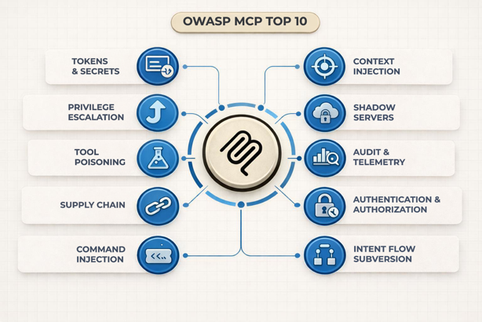

# OWASP MCP Top 10 Security Guidance for Azure

Aligned with MCP Specification [2025-11-2025](https://modelcontextprotocol.io/specification/2025-11-25) | [OWASP MCP Top 10](https://owasp.org/www-project-mcp-top-10/)

## What is the Model Context Protocol (MCP)?

Before diving into security, let’s understand what we’re protecting.

The Model Context Protocol (MCP) is a standardized way for AI assistants (Like VS Code, Claude, ChatGPT or custom AI Agents) to connect to tools and data sources. Think of MCP as a translator that lets AI systems and applications talk to databases, APIs, file systems, and other services in a consistent, predictable way.

> A Simple Example
>
> Imagine you ask an assistant: “Create a customer-ready summary of this incident.” With MCP, the assistant doesn’t need built-in knowledge of your systems. Instead, it discovers and invokes a set of MCP servers: one to retrieve incident logs, another to pull the related ticket, and a third to generate a formatted summary. Each capability is exposed as a discrete, governed tool with a clear contract. The assistant decides when to use a tool, but the tool strictly controls what it can do.
>
> Think of it like: MCP is like a profession interpreter at a business meeting. The interpreter (MCP) knows exactly how to translate requests between the executive (AI) and the various department heads (databases, APIs, tools), ensuring everyone communicates clearly and securely.

## Why Security Matters

MCP Servers often have access to sensitive resources: customer data, internal documents, financial systems, and more. A compromised MCP server could leak confidential information, execute unauthorized commands, or provide attackers with a backdoor into your organization.

This guide covers the OWASP MCP Top 10 – the ten most critical security risks for MCP implementations and shows how to address each one using Azure services.

## Reference Architecture

The diagram above illustrates a high-level reference architecture for deploying MCP servers securely on Azure. It highlights the primary trust boundaries and security layers involved in an MCP system, from identity and gateway enforcement to private execution, data access, and centralized telemetry.

This architecture is intentionally layered. No single control is assumed to be sufficient on its own. Instead, security is achieved through defense-in-depth by combining strong identity and authorization, network isolation, controlled execution environments, and continuous monitoring and governance.

Each risk described in the following sections maps to one or more components of this architecture.

## Azure Implementation Coverage

This guide provides Azure implementation guidance across three areas:

| Coverage | Meaning | Which Risks |
|----|----|----|
| FULL | Production-ready Azure services available | MCP01 (Secrets), MCP05 (Commands), MCP06 (Prompts), MCP07 (Auth), MCP08 (Logging) |
| PARTIAL | Core services available with custom work needed | MCP02 (Scope creep), MCP10 (Contexts sharing) |
| NEW | Emerging patterns and custom solutions needed | MCP03 (Tool poisoning), MCP04 (Supply chain), MCP09 (Shadow servers) |

## OWASP MCP Top 10

- [MCP01: Token Mismanagement and Secret Exposure](mcp/mcp01-token-mismanagement.md)
- [MCP02: Privilege Escalation via Scope Creep](mcp/mcp02-privilege-escalation.md)
- [MCP03: Tool Poisoning](mcp/mcp03-tool-poisoning.md)
- [MCP04: Supply Chain Attacks](mcp/mcp04-supply-chain.md)
- [MCP05: Command Injection and Execution](mcp/mcp05-command-injection.md)
- [MCP06: Prompt Injection via Contexts Payloads](mcp/mcp06-prompt-injection.md)
- [MCP07: Insufficient Authentication and Authorization](mcp/mcp07-authz.md)
- [MCP08: Lack of Audit and Telemetry](mcp/mcp08-telemetry.md)
- [MCP09: Shadow MCP Servers](mcp/mcp09-shadow-servers.md)
- [MCP10: Context Injection and Over-Sharing](mcp/mcp10-context-oversharing.md)

## Final Thoughts

Securing MCP deployments is not a one-time task and it’s an ongoing engineering practice. As the MCP specification evolves and new attack patterns emerge, these controls should be revisited and reinforced regularly. Effective MCP security is built on defense in depth: overlapping layers of protection designed so that when one control fails, others limit impact and preserve trust.

Network isolation plays a foundational role in this model. It is the security layer that continues to work even when assumptions break, especially when authentication is bypassed, tokens are stolen, prompts are compromised, or bugs slip into production. Properly segmented VNETS, Private Endpoints, and strict network policies ensure that compromised components remain unreachable from outside the trusted boundary.

Security and usability are not opposing goals. Well-designed MCP security with clear identity boundaries, strong isolation, comprehensive telemetry, and automated guardrails, results in systems that are easier to operate, easier to audit, and easier to evolve safely. The same controls that protect against attackers also reduce operational risk and improve reliability.

In MCP systems, trust is built through architecture. When security is treated as a first-class design constraint rather than an afterthought, MCP deployments can scale with confidence across teams, tenants, and time.