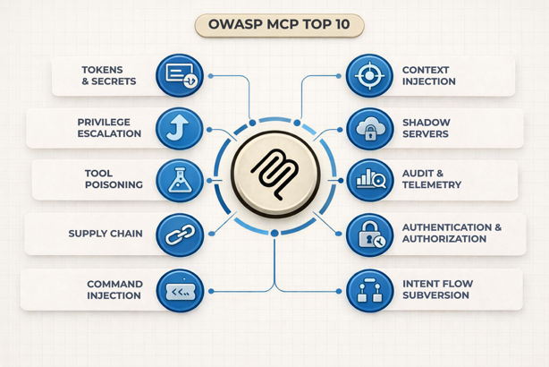
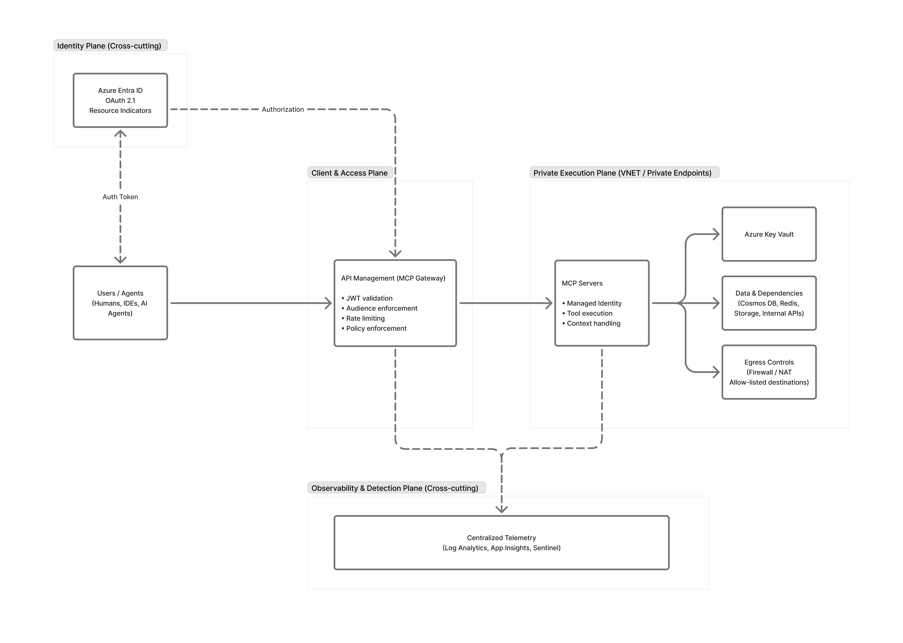

# OWASP MCP Top 10 Security Guidance for Azure

Aligned with the MCP Specification [2025-11-25](https://modelcontextprotocol.io/specification/2025-11-25) | [OWASP MCP Top 10](https://owasp.org/www-project-mcp-top-10/)

This guide provides comprehensive security and adoption guidance for implementing the Model Context Protocol (MCP) on Microsoft Azure. It combines the OWASP MCP Top 10 security framework with practical Azure implementation patterns, migration strategies, and lessons learned from enterprise deployments. Whether you're evaluating MCP, migrating existing APIs, or scaling to production, you'll find actionable guidance for building secure, governed MCP systems on Azure.

## What is the Model Context Protocol (MCP)?

Before diving into security, let’s understand what we’re protecting.

The Model Context Protocol (MCP) is a standardized way for AI assistants (like VS Code, Claude, ChatGPT, or custom AI agents) to connect to tools and data sources. Think of MCP as a translator that lets AI systems and applications talk to databases, APIs, file systems, and other services in a consistent, predictable way.

!!! tip "A Simple Example"

    **Imagine you ask an assistant:** "Create a customer-ready summary of this incident." With MCP, the assistant doesn't need built-in knowledge of your systems. Instead, it discovers and invokes a set of MCP servers: one to retrieve incident logs, another to pull the related ticket, and a third to generate a formatted summary. Each capability is exposed as a discrete, governed tool with a clear contract. The assistant decides when to use a tool, but the tool strictly controls what it can do.

    **Think of it like:** MCP is like a professional interpreter at a business meeting. The interpreter (MCP) knows exactly how to translate requests between the executive (AI) and the various department heads (databases, APIs, tools), ensuring everyone communicates clearly and securely.

## Why Security Matters

MCP servers often have access to sensitive resources: customer data, internal documents, financial systems, and more. A compromised MCP server could leak confidential information, execute unauthorized commands, or provide attackers with a backdoor into your organization.

This guide covers the OWASP MCP Top 10 – the ten most critical security risks for MCP implementations and shows how to address each one using Azure services.

## Minimum Safe Baseline for New MCP Deployments

If you're new to MCP, start with these defaults before exposing any high-impact tools:

- **Start read-only**: Prove the design with retrieval and reporting scenarios before enabling write, delete, or execution paths.
- **Treat tool outputs and retrieved resources as untrusted input**: MCP resources, tool descriptions, and tool outputs should inform the model, not silently override the user's original goal.
- **Use strong identity with least privilege**: Prefer Microsoft Entra ID, managed identities, short-lived scoped tokens, and per-server audience validation over shared secrets or long-lived credentials.
- **Allow only approved servers and destinations**: Pin approved server versions, maintain an internal allowlist, and restrict egress to known destinations.
- **Require approval for high-impact actions**: Route destructive, privileged, or externally visible operations through policy checks and, where appropriate, human approval.
- **Log the full decision path**: Capture authentication decisions, tool invocations, context access, and approval outcomes so incidents can be investigated quickly.

## Reference Architecture

The diagram above illustrates a high-level reference architecture for deploying MCP servers securely on Azure. It highlights the primary trust boundaries and security layers involved in an MCP system, from identity and gateway enforcement to private execution, data access, and centralized telemetry.

This architecture is intentionally layered. No single control is assumed to be sufficient on its own. Instead, security is achieved through defense-in-depth by combining strong identity and authorization, network isolation, controlled execution environments, and continuous monitoring and governance.

Each risk described in the following sections maps to one or more components of this architecture.

## Azure Implementation Coverage

This guide provides Azure implementation guidance across three areas:

| Coverage | Meaning | Which Risks |
|----|----|----|
| FULL | Production-ready Azure services available | MCP01 (Token Mismanagement and Secret Exposure), MCP05 (Command Injection & Execution), MCP06 (Intent Flow Subversion), MCP07 (Insufficient Authentication & Authorization), MCP08 (Lack of Audit & Telemetry) |
| PARTIAL | Core services available with custom work needed | MCP02 (Privilege Escalation via Scope Creep), MCP10 (Context Injection & Over-Sharing) |
| NEW | Emerging patterns and custom solutions needed | MCP03 (Tool Poisoning), MCP04 (Software Supply Chain Attacks & Dependency Tampering), MCP09 (Shadow MCP Servers) |

## MCP Adoption Strategy

Understanding when and how to adopt MCP helps you make informed architectural decisions before implementing security controls:

- **[When to Use MCP](adoption/when-to-use-mcp.md)**: Decision framework for determining when MCP adds value vs. when traditional APIs are more appropriate
- **[Migration Guidance](adoption/migration-guidance.md)**: Practical patterns for wrapping existing APIs and transitioning to MCP
- **[Development Best Practices](adoption/development-best-practices.md)**: Practical design, schema, and testing guidance for building MCP servers that agents can use safely
- **[Deployment Patterns](adoption/deployment-architecture.md)**: Recommended Azure deployment patterns for remote MCP servers, gateways, and production controls
- **[Enterprise Patterns & Lessons Learned](adoption/enterprise-patterns.md)**: Real-world adoption patterns, common mistakes, and proven strategies from organizations deploying MCP at scale

## OWASP MCP Top 10

The ten most critical security risks for MCP implementations, with Azure-specific mitigation guidance for each:

- [MCP01: Token Mismanagement and Secret Exposure](mcp/mcp01-token-mismanagement.md)
- [MCP02: Privilege Escalation via Scope Creep](mcp/mcp02-privilege-escalation.md)
- [MCP03: Tool Poisoning](mcp/mcp03-tool-poisoning.md)
- [MCP04: Software Supply Chain Attacks & Dependency Tampering](mcp/mcp04-supply-chain.md)
- [MCP05: Command Injection & Execution](mcp/mcp05-command-injection.md)
- [MCP06: Intent Flow Subversion](mcp/mcp06-prompt-injection.md)
- [MCP07: Insufficient Authentication and Authorization](mcp/mcp07-authz.md)
- [MCP08: Lack of Audit and Telemetry](mcp/mcp08-telemetry.md)
- [MCP09: Shadow MCP Servers](mcp/mcp09-shadow-servers.md)
- [MCP10: Context Injection & Over-Sharing](mcp/mcp10-context-oversharing.md)

## Putting It All Together

Securing MCP deployments is not a one-time task; it’s an ongoing engineering practice. As the MCP specification evolves and new attack patterns emerge, these controls should be revisited and reinforced regularly. Effective MCP security is built on defense in depth: overlapping layers of protection designed so that when one control fails, others limit impact and preserve trust.

Network isolation plays a foundational role in this model. It is the security layer that continues to work even when assumptions break, especially when authentication is bypassed, tokens are stolen, prompts are compromised, or bugs slip into production. Properly segmented VNets, Private Endpoints, and strict network policies ensure that compromised components remain unreachable from outside the trusted boundary.

Security and usability are not opposing goals. Well-designed MCP security with clear identity boundaries, strong isolation, comprehensive telemetry, and automated guardrails, results in systems that are easier to operate, easier to audit, and easier to evolve safely. The same controls that protect against attackers also reduce operational risk and improve reliability.

In MCP systems, trust is built through architecture. When security is treated as a first-class design constraint rather than an afterthought, MCP deployments can scale with confidence across teams, tenants, and time.

## Contributors

This guide was created and maintained by:

- [:fontawesome-brands-github: David Barkol](https://github.com/dbarkol) - Author
- [:fontawesome-brands-github: Jitesh Thakur](https://github.com/Jitha-afk) - Co-author
