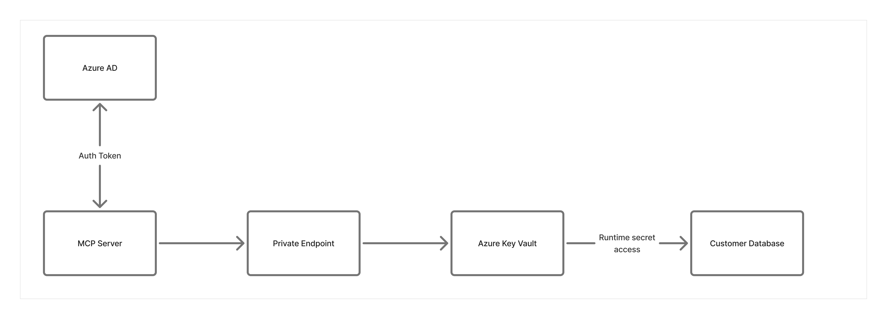

# MCP01: Token Mismanagement & Secret Exposure

### Azure Implementation: FULL


> **Real-World Scenario**: The Accidental GitHub Leak
>
> Nelson is a developer building an MCP server that connects to his company’s customer database. To test quickly, he hardcodes the database password directly in his code:
>
> ``` connection_string = ‘Server=prod;Password=SuperSecret123’ ```
>
> He commits the code to GitHub. Within hours, automated bots scanning public repositories find the credential. By morning, attackers have downloaded the entire customer database with names, emails and purchase history, and are demanding ransom.
>
> What began as a temporary shortcut results in a full compromise of sensitive customer data (way to go, Nelson).
>
> **Think of it like**: Leaving your house key under the doormat. Sure, it’s convenient when you forget your key, but it’s the first place a burglar looks. Hardcoded credentials are the digital equivalent as they are discoverable and dangerous.

## Understanding the Risk

MCP servers require credentials to access databases, APIs, and downstream services. When these secrets are stored improperly in source code, configuration files, environment variables, or logs, they become easy targets for attackers.

This risk is amplified in MCP systems. MCP servers often act as high-privilege aggregation points, accessing multiple tools and services on behalf of users. A single exposed credential can unlock far more than a single system, dramatically increasing blast radius.

Once a secret is leaked, attackers can operate silently, impersonate trusted services, and move laterally through the environment.

**Common mistakes**:

- Hardcoding passwords or API keys directly in source control
- Storing secrets in plain-text configuration files
- Logging full API responses that contain tokens
- Using long-lived tokens that never expire

## The Azure Solution

Azure provides a mature secrets and identity model that eliminates the need to embed credentials in MCP server code.

**Prefer identity over secrets**  
Managed Identity should be the default authentication mechanism for Azure-hosted MCP servers. Instead of storing credentials, the MCP server receives a secure identity that Azure services trust automatically. No passwords, keys, or connection strings are required.

**Centralized secrets management**  
When secrets are unavoidable (for example, third-party APIs), Azure Key Vault acts as the single secure store. Secrets are retrieved at runtime and never committed to code or configuration files. Even if source code is exposed, credentials remain protected.

**Secret rotation and auditability**  
Key Vault supports automatic secret rotation and detailed access logging. This limits the impact of exposure and provides an audit trail for compliance and investigation.

**Response inspection as a safety net**  
Azure AI Content Safety can be used as a last-resort signal to detect accidental exposure of credentials in responses or logs. It should not be relied on as a primary protection mechanism.



**Network Security Layer Considerations**:

- Deploy Key Vault with Private Endpoint so that secrets never traverse the public internet
- Configure Key Vault firewall to deny public access entirely
- MCP servers access Key Vault through the VNET, not over the internet
- Even if credentials are leaked, attackers outside the network can’t reach Key Vault

**Key Takeaways**:

- Prefer Managed Identity for all Azure-to-Azure access
- Never store secrets in source code, configuration files, or environment variables
- Store unavoidable secrets in Azure Key Vault
- Enable automatic secret rotation and audit logging
- Use response inspection as a safety net, not a primary control