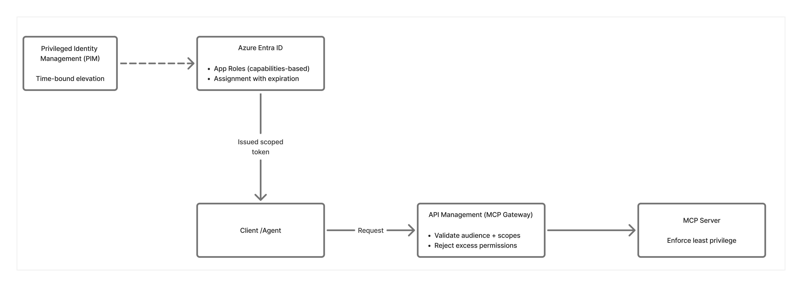

# MCP02: Privilege Escalation via Scope Creep

### Azure Implementation: PARTIAL

!!! tip "Real-World Scenario: The Feature That Never Left"

    Madeline's team builds an MCP server to help developers check code quality. Initially, it only needs read-only access to GitHub repositories. Six months later, a new feature requires write access to update README files. A developer grants write permissions, the feature launches, and the team moves on.

    A year later, the README feature is deprecated but the write permissions remain. When a developer’s credentials are later compromised through a phishing attack, the attacker inherits the MCP server’s accumulated permissions. What began as a read-only tool can now read and modify production repositories, inject malicious code, and alter build pipelines.

    The permissions didn’t change suddenly. They quietly grew and were never reduced.

    **Think of it like**: Giving a house-sitter the keys to every room, the safe, and your car even though they only need access to the kitchen to feed your cat, Spike. Over time, you forget what access you’ve granted. If someone steals those keys, they have access to everything, not just what was necessary.

## Understanding the Risk

Permissions tend to expand over time but rarely contract. As MCP servers evolve, new features often require additional scopes, roles, or privileges. When features are removed or changed, those permissions are rarely revisited.

This creates **scope creep**: a condition where an MCP server accumulates more authority than it actively uses. Because MCP servers often operate as shared services on behalf of many users, excess permissions dramatically increase blast radius. A single compromised token, identity, or service account can unlock capabilities that were never intended to be exposed.

## The Azure Solution

Reducing privilege creep requires intentional permission design, expiration, and enforcement.

**Define explicit, capability-based roles**  
Azure Entra ID App Roles allow you to define fine-grained permissions aligned to specific MCP capabilities (for example, mcp.repos.read or mcp.docs.update). Avoid broad or catch-all roles that grant more access than required.

**Enforce time-bound access**  
Time-bound role assignments ensure elevated permissions automatically expire. This forces periodic review and prevents powerful access from lingering long after it’s needed.

**Validate scopes at the gateway**  
Azure API Management can validate that incoming requests contain *only* the scopes required for the operation being performed. Requests carrying excess permissions can be rejected, even if the token itself is valid.

**Protect administrative access**  
Privileged Identity Management (PIM) requires administrators to explicitly activate elevated permissions for a limited time, creating audit trails and reducing standing privilege.

!!! warning

    Azure doesn't automatically reduce permissions based on actual usage. You'll need to implement recurring access reviews and manually audit which permissions are being used versus which are just sitting unused.

**Key Takeaways**:

- Define specific App Roles for each MCP tool capability and avoid broad “admin” roles
- Set maximum expiration period on all role assignments (consider 90-days)
- Use APIM to validate token scopes match the specific operation being performed
- Conduct routine access reviews using [Entra ID access reviews](https://learn.microsoft.com/en-us/entra/id-governance/access-reviews-overview)
- Enable PIM for any administrative operations requiring elevated access
---

## Next Steps

- **Related risks**: [MCP07: Insufficient Authentication & Authorization](mcp07-authz.md) | [MCP01: Token Mismanagement](mcp01-token-mismanagement.md)
- **Monitoring**: [MCP08: Lack of Audit & Telemetry](mcp08-telemetry.md) to detect privilege escalation attempts
- **Strategic guidance**: [Enterprise Patterns & Lessons Learned](../adoption/enterprise-patterns.md) for separating read/write operations
- **Back to**: [OWASP MCP Top 10](../index.md#owasp-mcp-top-10)