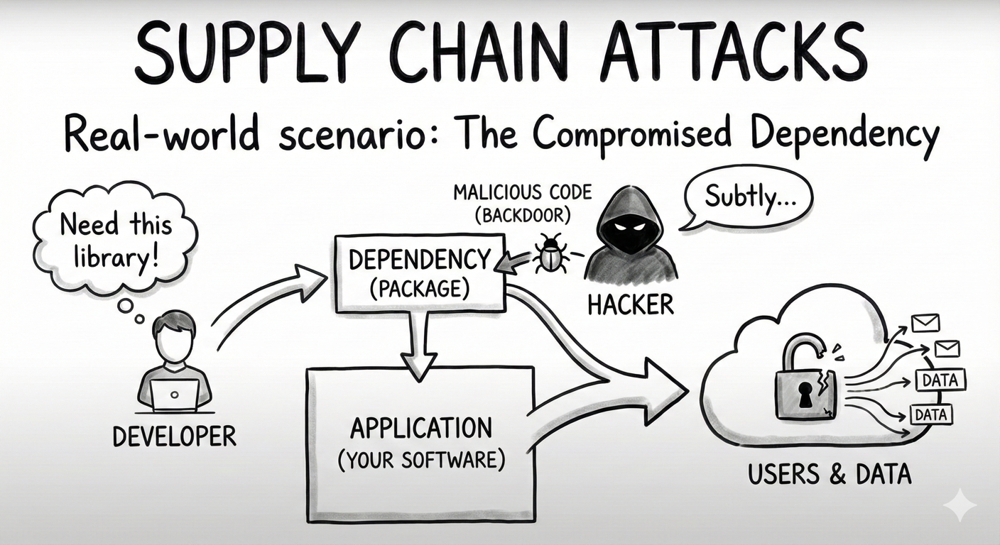

# MCP04: Software Supply Chain Attacks & Dependency Tampering

### Azure Implementation: NEW GUIDANCE

!!! tip "Real-World Scenario: The Compromised Dependency"

    Your team builds an MCP server using popular open-source libraries. One of those libraries is a small utility package with thousands of weekly downloads that is maintained by a single developer. An attacker compromises that developers’s npm account and publishes a new version containing malicious code that runs during installation. The code silently copies environment variables (including your Azure credentials) to an external server. Within hours, attackers are using your credentials to spin up cryptocurrency miners in your Azure subscription.

    **Think of it like**: Building a house where one of the suppliers was secretly compromised. The lumber looks fine, the nails look fine, but unknown to you, the electrical wiring has been tampered with. The house appears to work normally until one day it catches fire.

## Understanding the Risk

Modern software relies on hundreds of open-source packages, SDKs, base images, and build-time components. Each dependency can bring its own transitive dependencies, creating a broad software supply chain. A vulnerability, tampering event, or malicious package anywhere in that chain can affect your MCP server.

In MCP environments, this risk also includes compromised connectors, poisoned server images, modified manifests, and dependency confusion attacks that change what code or tooling is actually deployed.

## The Azure Solution

Supply chain attacks cannot be prevented with a single control. Azure addresses this risk by combining build-time inspection, controlled dependency sourcing, runtime isolation, and cloud-level blast radius reduction.

**Build-time dependency inspection**  
Microsoft Defender for Cloud (DevOps Security) integrates with GitHub and other CI/CD platforms to scan repositories and pipelines for vulnerable or malicious dependencies. It surfaces risks early and can be used to gate builds that include critical issues before they reach production MCP servers.

**Controlled dependency sourcing**  
Azure Artifacts enables private package feeds for vetted and approved dependencies. MCP server builds pull packages from internal feeds rather than directly from public registries, reducing exposure to compromised or typosquatted packages.

**Software Bill of Materials (SBOM)**  
Generating an SBOM using Microsoft’s SBOM tooling creates a complete inventory of all components included in an MCP server deployment. When new vulnerabilities or malicious packages are discovered, teams can quickly determine whether their MCP servers are affected.

**Blast-radius reduction for MCP servers**  
Even with strong build controls, assume compromise is possible. MCP servers should run with Managed Identity and least-privilege access so that compromised code cannot access unrelated Azure resources. Limiting permissions and enforcing network egress controls reduces the impact of stolen credentials or malicious runtime behavior.

**Automated dependency updates**  
Tools such as Dependabot or Renovate automatically propose dependency updates across GitHub-based workflows. Consider auto-merge only for low-risk, well-tested patch updates; require review for runtime-critical or security-sensitive dependencies.

**Key Takeaways**:

- Run npm audit / pip-audit in your CI/CD pipeline and fail builds on high-severity issues
- Generate an SBOM for every deployment to track all components
- Use private Azure Artifacts feeds for vetted packages and base images
- Verify provenance, signatures, or checksums for critical dependencies and artifacts
- Enable Defender for Cloud DevOps Security on all repositories
- Set up automated dependency updates with human review for sensitive changes

---

## Next Steps

- **Related risks**: [MCP03: Tool Poisoning](mcp03-tool-poisoning.md) | [MCP09: Shadow MCP Servers](mcp09-shadow-servers.md)
- **Monitoring**: [MCP08: Lack of Audit & Telemetry](mcp08-telemetry.md) to track dependency changes
- **Strategic guidance**: [Enterprise Patterns & Lessons Learned](../adoption/enterprise-patterns.md) for version management best practices
- **Back to**: [OWASP MCP Top 10](../index.md#owasp-mcp-top-10)