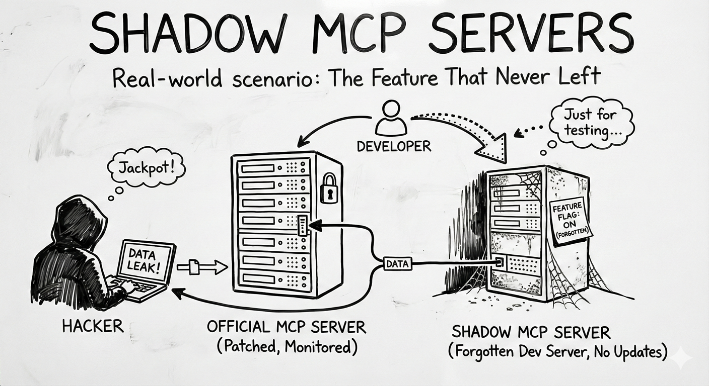

# MCP09: Shadow MCP Servers

### Azure Implementation: NEW GUIDANCE



> **Real-World Scenario**: The Feature That Never Left
>
> The data science team needs to demo an AI Agent at a conference next week. Under time pressure, they spin up a Container App running an MCP server with minimal configuration: no authentication, public internet access, and an admin password of ```conference123```. The demo goes well, everyone moves on to other projects, and the server is forgotten.
>
> Three months later, an external researcher doing internet scans finds this server, gains access, and discovers it has database credentials for internal systems. The ‘temporary’ demo server has been quietly exposing the company’s infrastructure for months.
>
> **Think of it like**: A side door open with a brick ‘just for the day’ during a furniture delivery. Weeks later, no one remembers the delivery, but the door is still propped open, and anyone walking by can walk in.

## Understanding the Risk

Shadow IT has always been a security challenge, but shadow MCP servers are particularly dangerous. They often have access to sensitive data and tools, they're deployed quickly without security review, and they're easily forgotten. Unlike a forgotten file share, a forgotten MCP server is an active service that attackers can interact with.

## The Azure Solution

## Preventing shadow MCP servers requires governance, discovery, and containment, not just runtime security.

**Prevent unauthorized deployments**  
Azure Policy enforces organizational standards at deployment time. Require mandatory tags such as *mcp-server-approved*, *owner*, and *security-review-date* on all compute resources. Use *deny* effects to block deployments that bypass approval.

**Discover existing shadow servers**  
Microsoft Defender for Cloud continuously discovers running containers and services across subscriptions, surfacing misconfigurations, exposed endpoints, and ungoverned workloads. Azure Resource Graph queries can further identify resources that match MCP patterns but lack approval or ownership metadata.

**Enforce ownership and lifecycle controls**  
Automated compliance workflows using Logic Apps can trigger on new deployments. Resources without required tags or approvals generate alerts, assign ownership, and initiate review or shutdown processes. This ensures every MCP server has an accountable owner and a defined lifecycle.

**Contain exposure through network controls**  
Network policies act as a final backstop:

- Use Azure Policy to deny public endpoints on Container Apps and AKS by default
- Require deployment into approved VNets only
- Even unauthorized deployments cannot become internet-accessible

**Key Takeaways**:

- Deploy Azure Policy requiring ‘mcp-server-approved=true’ tag with deny effect
- Require ownership and security review tags on all MCP deployments
- Deny public endpoints for Container Apps and AKS by default
- Restrict deployments to approved VNets only
- Run recurring Resource Graph queries to detect unapproved or orphaned MCP servers
